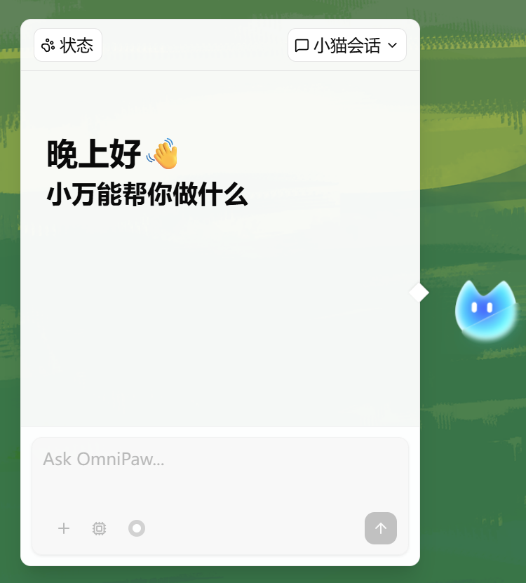
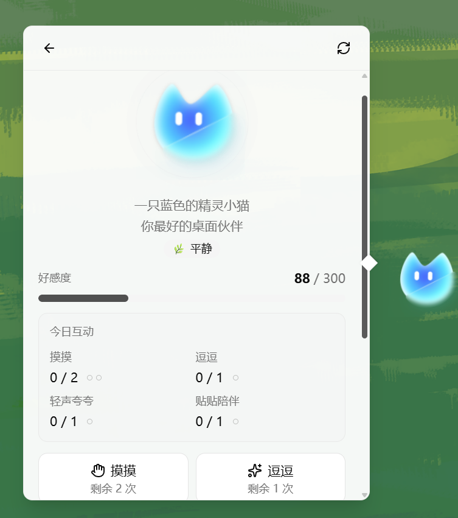

<div align="center">


**Understand your AI desktop pet better, work with you, accompany you by your side**

English | [简体中文](README.zh-CN.md)

[](https://www.electronjs.org/)
[](https://vuejs.org/)
[](https://www.typescriptlang.org/)
[](https://pnpm.io/)
[](LICENSE)

</div>

OmniPaw is a local-first AI desktop pet that lives on your desktop and gradually gets to know you through everyday interactions. It can see and remember what you are doing, work alongside you, and keep you company throughout the day. Choose its character and appearance, build affection, watch its mood change, and unlock gifts as your bond grows.

## Features

- **Continuous visual awareness** - With your permission, your pet can observe your desktop, understand what you are doing, and remember the things you enjoy and do often
- **A relationship that grows** - Affection and daily interactions make every moment part of an ongoing relationship—and your pet may even surprise you with a gift
- **A character and look of your own** - Deep customization lets you create a truly unique companion, while character card import and export make it easy to share your creation with the community
- **Works alongside you** - A capable Agent harness, scheduled reminders, and task execution help you stay productive without leaving your current workflow
- **Agent capabilities behind the companion** - Extend what your pet can do with Skills, MCP, a local workspace, terminal processes, and configurable tool permissions

## Screenshots

<p align="center">
  
  <br />
</p>

<table>
  <tr>
    <td width="50%">
      
    </td>
    <td width="50%">
      
    </td>
  </tr>
  <tr>
    <td align="center"><strong>Chat with Your Desktop Pet</strong></td>
    <td align="center"><strong>Relationship and Status</strong></td>
  </tr>
  <tr>
    <td width="50%">
      
    </td>
    <td width="50%">
      
    </td>
  </tr>
  <tr>
    <td align="center"><strong>Visual Observation and Proactive Feedback</strong></td>
    <td align="center"><strong>Scheduled Tasks and Tool Calls</strong></td>
  </tr>
</table>

## Tech Stack

| Layer | Technology |
|------|------|
| **Desktop Framework** | [Electron](https://www.electronjs.org/) + [electron-vite](https://electron-vite.org/) |
| **Frontend** | [Vue 3](https://vuejs.org/) + [TypeScript](https://www.typescriptlang.org/) |
| **Routing and State** | [Vue Router](https://router.vuejs.org/) + [Pinia](https://pinia.vuejs.org/) |
| **UI** | [shadcn-vue](https://www.shadcn-vue.com/) + [Reka UI](https://reka-ui.com/) + [Tailwind CSS v4](https://tailwindcss.com/) |
| **Database** | [better-sqlite3](https://github.com/WiseLibs/better-sqlite3) |
| **Build and Quality** | [Vite](https://vite.dev/) + [vue-tsc](https://github.com/vuejs/language-tools) + [Biome](https://biomejs.dev/) |

## Installation

### Download from Releases

Release packages are not available yet. For now, run or build the app from source.

### Run from Source

#### Requirements

- [Node.js](https://nodejs.org/) `>=22.12.0`
- [pnpm](https://pnpm.io/) `10.x`

#### Start the Development Environment

```bash
pnpm install
pnpm dev
```

`pnpm dev` rebuilds Electron native dependencies first, then starts the desktop development environment.

#### Build for Production

```bash
pnpm build
```

#### Preview the Built App

```bash
pnpm start
```

#### Package the App

```bash
pnpm pack
pnpm dist
```

## Contributing

Issues and pull requests are welcome. Before adding a new feature, please open an issue to describe the use case, UI entry point, and data boundary so it fits the current Electron / core / renderer architecture.

## License

This project uses a segmented dual-licensing model. Non-commercial, personal, educational, or research use is available under AGPL v3. Commercial use requires a commercial license. See [LICENSE](LICENSE) for details.
