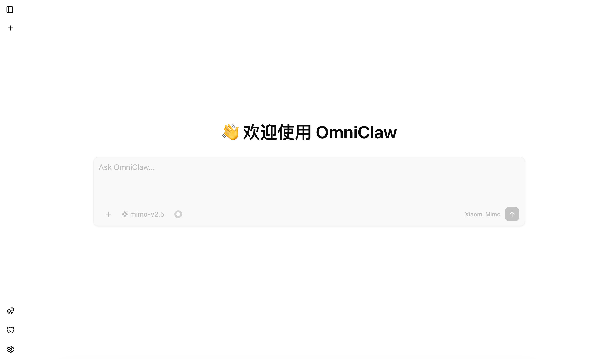
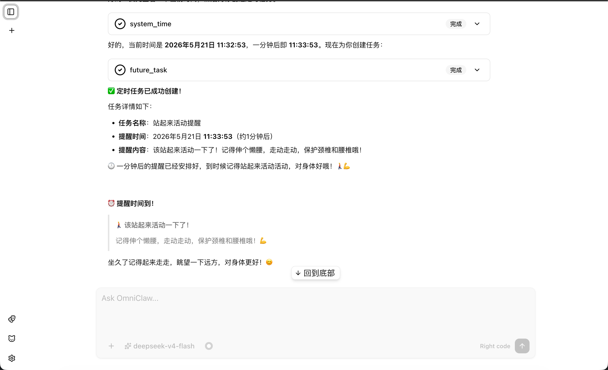
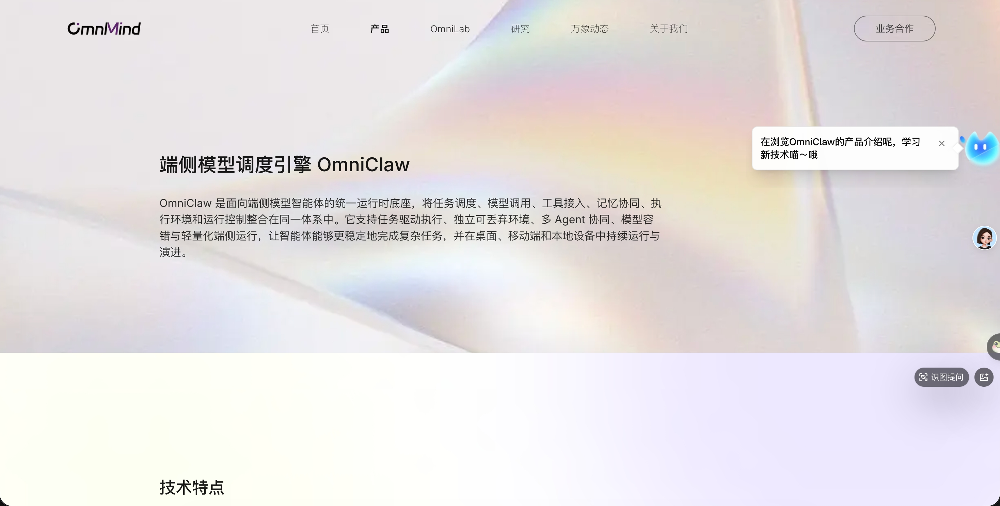

<div align="center">


# OpenOmniClaw

**A desktop AI assistant and Agent client for edge-side models**

English | [简体中文](README.zh-CN.md)

[](https://www.electronjs.org/)
[](https://vuejs.org/)
[](https://www.typescriptlang.org/)
[](https://pnpm.io/)
[](LICENSE)

</div>

OpenOmniClaw is a desktop AI assistant client designed to make locally deployed or LAN-hosted OpenAI-compatible models easier to use in everyday workflows. It provides chat, tavern role-play, visual observation, Skills, MCP, Agent tools, scheduled tasks, and other local-first capabilities.

## Features

- **OpenAI-compatible model services** - Configure OpenAI-compatible providers, model lists, default models, and fallback models
- **Desktop cat assistant** - Floating window, notification bubbles, session entry points, and runtime state sync
- **Persona and context management** - Persona profiles, system context, attachment context, and automatic compaction policies
- **Agent tooling** - Skills, MCP, local workspace, terminal process management, and configurable tool permissions
- **Scheduled tasks and proactive observation** - Scheduled task execution, visual observation, and notification feedback
- **Local-first data** - Config, providers, personas, SQLite data, attachments, skill state, and logs are stored locally by default

## Screenshots

<p align="center">
  
</p>

<table>
  <tr>
    <td width="50%">
      
    </td>
    <td width="50%">
      
    </td>
  </tr>
  <tr>
    <td align="center"><strong>Tavern Session</strong></td>
    <td align="center"><strong>Scheduled Tasks and Tool Calls</strong></td>
  </tr>
  <tr>
    <td colspan="2">
      
    </td>
  </tr>
  <tr>
    <td colspan="2" align="center"><strong>Visual Observation and Desktop Assistant</strong></td>
  </tr>
</table>

## Tech Stack

| Layer | Technology |
|------|------|
| **Desktop Framework** | [Electron](https://www.electronjs.org/) + [electron-vite](https://electron-vite.org/) |
| **Frontend** | [Vue 3](https://vuejs.org/) + [TypeScript](https://www.typescriptlang.org/) |
| **Routing and State** | [Vue Router](https://router.vuejs.org/) + [Pinia](https://pinia.vuejs.org/) |
| **UI** | [shadcn-vue](https://www.shadcn-vue.com/) + [Reka UI](https://reka-ui.com/) + [Tailwind CSS v4](https://tailwindcss.com/) |
| **Database** | [better-sqlite3](https://github.com/WiseLibs/better-sqlite3) |
| **Build and Quality** | [Vite](https://vite.dev/) + [vue-tsc](https://github.com/vuejs/language-tools) + [Biome](https://biomejs.dev/) |

## Installation

### Download from Releases

Release packages are not available yet. For now, run or build the app from source.

### Run from Source

#### Requirements

- [Node.js](https://nodejs.org/) `>=22.12.0`
- [pnpm](https://pnpm.io/) `10.x`

#### Start the Development Environment

```bash
pnpm install
pnpm dev
```

`pnpm dev` rebuilds Electron native dependencies first, then starts the desktop development environment.

#### Build for Production

```bash
pnpm build
```

#### Preview the Built App

```bash
pnpm start
```

#### Package the App

```bash
pnpm pack
pnpm dist
```

## First Use

1. Start the app and open Settings.
2. Add an OpenAI-compatible provider under Model Services.
3. Select the default chat model and fallback models under Default Models.
4. Enable Persona, Tavern, Skills, MCP, local Agent tools, scheduled tasks, or visual observation as needed.

## Contributing

Issues and pull requests are welcome. Before adding a new feature, please open an issue to describe the use case, UI entry point, and data boundary so it fits the current Electron / core / renderer architecture.

## License

This project uses a segmented dual-licensing model. Non-commercial, personal, educational, or research use is available under AGPL v3. Commercial use requires a commercial license. See [LICENSE](LICENSE) for details.
